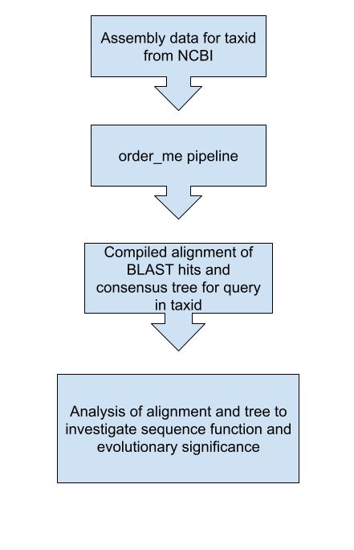
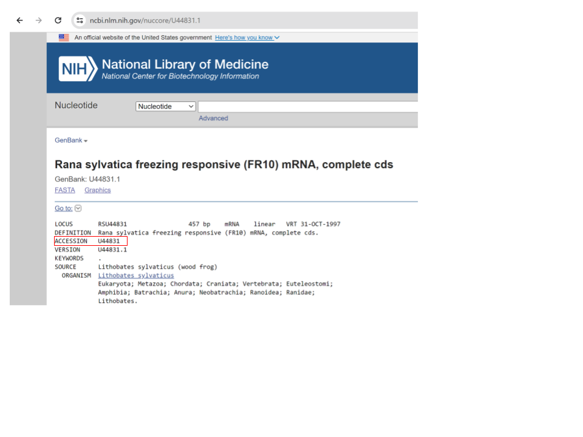
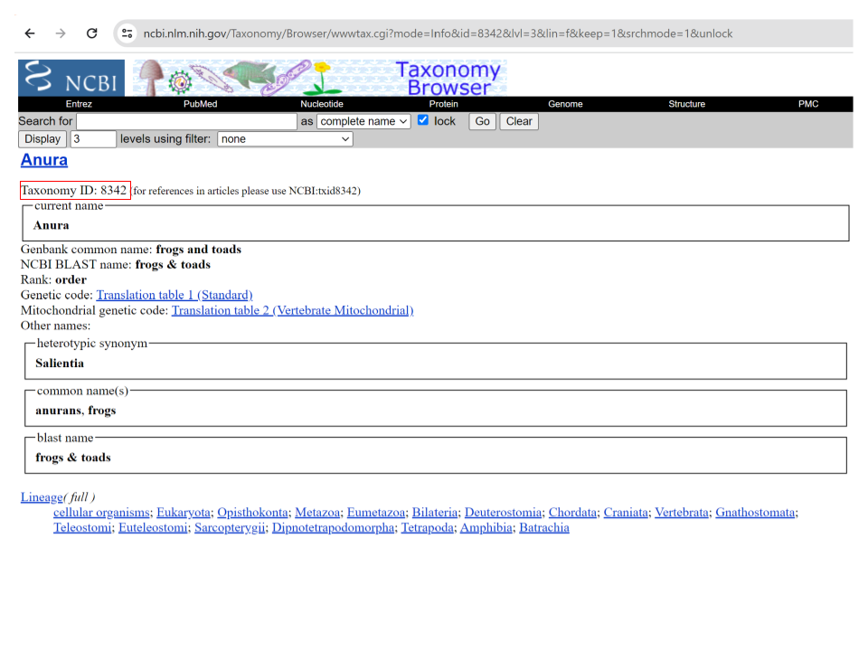
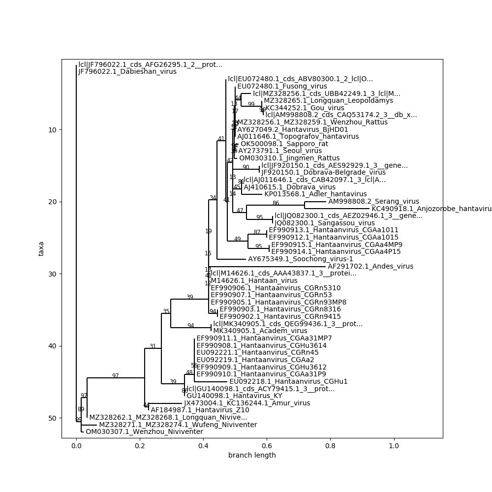

# order_me Pipeline
## Contents

- [Introduction](#introduction)
- [Dependencies](#dependencies)
- [How to use](#how_to_use)
- [Run with test data](#Run_with_test_data)
- [Purpose and usage of individual scripts](#indv_scripts)
- [Other scripts](#Other_scripts)
## Introduction

`order_me` is a pipeline of 9 bash and python scripts designed to track the evolution of a specific sequence of interest within a specified taxonomic group. Various scripts download genomic data, perform sequence searches, generate alignments and create a consensus tree. Subseqent analysis of the results can be used to identify homologs, investigate sequencence function, and determine evolutionary significance. This pipeline is intended to be run with a slurm workload manager.  

General data flow:




## Dependencies

Ensure that the following dependencies are accessable before running the pipeline:
- blast (performing local alignment search)
- Python 3 (processing blast results)
- BioPython (downloading genomes and dealing with fastas)
- Pandas (dealing with tsv blast results)
- iqtree (generating trees)
- mafft (aligning blast results)

Alternativley there is a conda environment with the required dependencies that can be loaded by running:

MAKE SURE YOU HAVE IMPORTANT DOCUMENTS SAVED...

```bash
conda env create -f order_me_env.yml
conda activate order_me_environment
```

## How to Use

### 1. Clone the repository

```bash
git clone [repository_url]
cd order_me
```
### 2. Get accession ID for sequence of interest
Go to https://www.ncbi.nlm.nih.gov/nuccore to find the accession ID for your sequence

### 3. Get taxid for taxonomic group to search
Go to https://www.ncbi.nlm.nih.gov/Taxonomy/Browser/wwwtax.cgi to find the taxid associated with the group you want to search



NOTE! BE CAREFUL SELECTING TAXID AS THIS PIPELINE WILL DOWNLOAD ALL AVALIABLE ASSEMBLIES ASSOCIATED WITH THAT TAXID WHICH CAN EASILY BE > 1TB

### 4. Download assemblies and make blast dbs
```bash
bash setup_blast.sh --save_path [path] --taxid [taxonomic_id] --email [your_email]
```
--save_path is the directory where a subdirectory with the assemblies and blast dbs will be created. It's a good idea to make sure the is suffient disk space available.

Alternativley, this can be accomplished by using the --setup True option with order_me.sh
### 5. Run pipeline
```bash
bash order_me.sh --query [sequence_id] --taxid [taxonomic_id] --email [your_email] [other_options...]
```
Default options assume that assemblies direcetory is in the current directory to change this use:
```bash
--save_path [path_to_assemblies]
```
Additionally, if this is the first time searching a certain taxid, make sure to use the option:
```bash
--setup True
```
Defaults and are set to result in the maximum number of hits (blast_type = blastn_short, evalue = 0.0001) 

To modify this, simply use the options: 
```bash
--blast_type [blastn, blastn_short, tblastx] --evalue[your_evalue]
```
NOTE: WHILE FUNCTIONALITY FOR TBLASTX IS INCLUDED IT HAS NOT BE SUFFICENTLY TESTED AND SHOULD BE USED WITH CAUTION

Successful execution of order_me.sh will generate an alignment named:
```bash
"$query"_in_"$taxid"_"$blast_type".fasta
```

### 6. Check alignment for unmerged sequences and generate trees
When you are satisfied with the alignment generate the trees using:
```bash
bash make_tree.sh [generated_alignment]
```
## Run with test data
Test data is included with the order_me repository 

To run the pipline with this data use:
```bash
bash order_me.sh --query OR734632 --taxid 1980413 --email [your_email]
``` 
This searches the taxonomic group Hantaviridae for sequences homologous to the Hantavirus nucleocapsid protein gene

[Output Alignment](OR734632_in_1980413_blastn_short.fasta)

[Consensus Tree](OR734632/OR734632_in_1980413_blastn_short_tree.png)

NOTE THE NAMING ISSUES THAT NEED TO BE FIXED/MERGED IN THE GENERATED FASTA

## Purpose and usage of individual scripts

### order_me.sh
Main script for running the order_me pipelne

Usage: See above
### setup_blast.sh
Downloading assemblies with `get_genomes.py` and making blast dbs for said assemblies

Usage: 
```bash
bash setup_blast.sh --save_path [to_save_assemblies] --taxid [your_taxID] --email [your@email.com]
```
### get_genomes.py
Downolading assemblies for a specified taxonomic group using Entrez from NCBI

Usage:
```bash
python3 --save_path [to_save_assemblies] --taxid [your_taxID] --email [your@email.com]
```
### blast_em.sh
Running BLAST searches, processing the results and creating a compiled alignment of the hits.

Usage:
```bash
bash blast_em.sh --Assemblies [assemblies_dir] --query [queryID] --blast_type [blastn, blastn_short, tblastx] --evalue [evalue] --merge_by [species, id] --output_alignment[name_to_save_alignment]
```
BLAST results for individual assemblies can be viewed in the assemblies directory 

[Example](Assemblies_1980413/ASM282226v1/GCA_002822265.1_ASM282226v1_cds_from_genomic_OR734632_blastn_short_results_formatted.tsv)

NOTE: PROCESSING BLAST REUSLTS WILL NOT WORK IF --BLAST_TYPE TBLASTX IS USED 
### get_fasta_from_blast.py 
Making fasta files for each blast hit with query sequence to align
Usage: 
```bash
python3 get_fasta_from_blast.py results_file [_blastn.tsv] header [must_match_outfmt_of_blast] query_file [query.fasta]
```
Fasta for individual hits are saved with the associated assembly

[Example](Assemblies_1980413/ASM282226v1/GCA_002822265.1_ASM282226v1_cds_from_genomic_OR734632_blastn_short_results_formatted_combined_0.fasta) 

### merge_by_species.py
Generating a consensus sequence for each species in the input fasta

Usage:
```bash
python3 merge_by_species.py [input_fasta] [output_fata] [queryID]
```

### merge_by_id.py 
Generating a consensus sequence for each sequence accession ID in the input fasta

Usage:
```bash
python3 merge_by_id.py [input_fasta] [output_fata] [queryID]
```

### make_tree.sh
Generating trees form alignment created by `order_me` pipeline

Usage:
```bash
bash make_tree.sh [alignment_file.fasta]
```

### view_tree.py
Creating png image from consensus tree

Usage:
```bash
python3 view_tree.py [treefile] [outfile]
```
## Other scripts (not used in order_me pipeline)
Other helpful scripts are included for dealing with fastas

These scripts are not thourghly documented so use at your own risk


